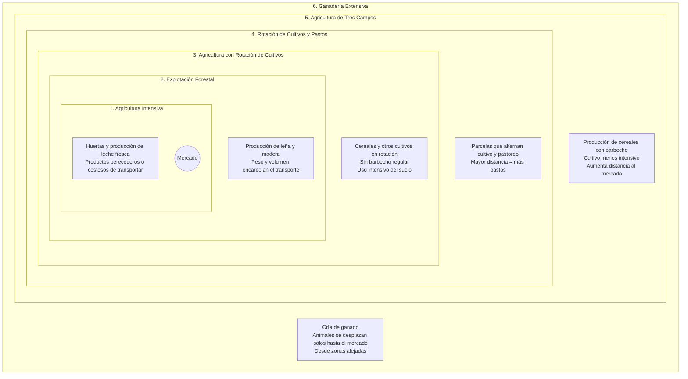

```mermaid
graph TD
    subgraph Anillo6["6. Ganadería Extensiva"]
        A6["Cría de ganado<br/>Animales se desplazan solos hasta el mercado<br/>Desde zonas alejadas"]
        subgraph Anillo5["5. Agricultura de Tres Campos"]
            A5["Producción de cereales con barbecho<br/>Cultivo menos intensivo<br/>Aumenta distancia al mercado"]
            subgraph Anillo4["4. Rotación de Cultivos y Pastos"]
                A4["Parcelas que alternan cultivo y pastoreo<br/>Mayor distancia = más pastos"]
                subgraph Anillo3["3. Agricultura con Rotación de Cultivos"]
                    A3["Cereales y otros cultivos en rotación<br/>Sin barbecho regular<br/>Uso intensivo del suelo"]
                    subgraph Anillo2["2. Explotación Forestal"]
                        A2["Producción de leña y madera<br/>Peso y volumen encarecían el transporte"]
                        subgraph Anillo1["1. Agricultura Intensiva"]
                            A1["Huertas y producción de leche fresca<br/>Productos perecederos o costosos de transportar"]
                            M(("Mercado"))
                        end
                    end
                end
            end
        end
    end
```
