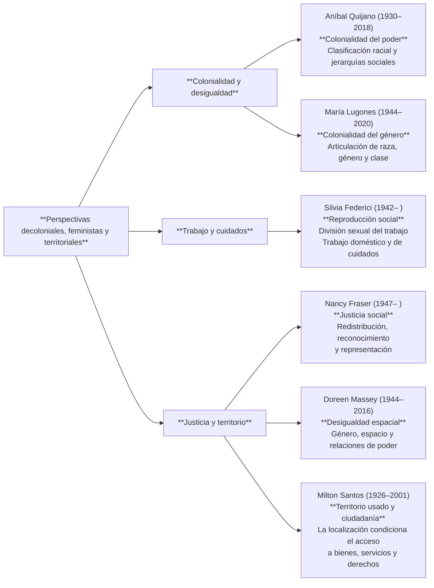

```mermaid
flowchart LR
    A["**Perspectivas decoloniales, feministas y territoriales**"]

    A --> B["**Colonialidad y desigualdad**"]
    A --> C["**Trabajo y cuidados**"]
    A --> D["**Justicia y territorio**"]

    B --> Quijano["Aníbal Quijano (1930–2018)<br/>**Colonialidad del poder**<br/>Clasificación racial y jerarquías sociales"]
    B --> Lugones["María Lugones (1944–2020)<br/>**Colonialidad del género**<br/>Articulación de raza, género y clase"]

    C --> Federici["Silvia Federici (1942– )<br/>**Reproducción social**<br/>División sexual del trabajo<br/>Trabajo doméstico y de cuidados"]

    D --> Fraser["Nancy Fraser (1947– )<br/>**Justicia social**<br/>Redistribución, reconocimiento<br/>y representación"]
    D --> Massey["Doreen Massey (1944–2016)<br/>**Desigualdad espacial**<br/>Género, espacio y relaciones de poder"]
    D --> Santos["Milton Santos (1926–2001)<br/>**Territorio usado y ciudadanía**<br/>La localización condiciona el acceso<br/>a bienes, servicios y derechos"]
```
