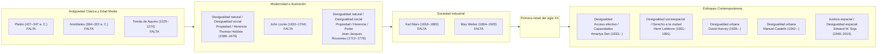

```mermaid
flowchart LR
    subgraph A["Antigüedad Clásica y Edad Media"]
        A1["Platón (427–347 a. C.)
        FALTA"]
        A2["Aristóteles (384–322 a. C.)
        FALTA"]
        A3["Tomás de Aquino (1225–1274)
        FALTA"]
    end

    subgraph B["Modernidad e Ilustración"]
        B1["Desigualdad natural / Desigualdad social
        Propiedad / Herencia
        Thomas Hobbes (1588–1679)"]
        B2["John Locke (1632–1704)
        FALTA"]
        B3["Desigualdad natural / Desigualdad social
        Propiedad / Herencia / Poder
        Jean-Jacques Rousseau (1712–1778)"]
    end

    subgraph C["Sociedad Industrial"]
        C1["Karl Marx (1818–1883)
        FALTA"]
        C2["Max Weber (1864–1920)
        FALTA"]
    end

    subgraph D["Primera mitad del siglo XX"]
        D0[" "]
    end

    subgraph E["Enfoques Contemporáneos"]
        E1["Desigualdad
        Acceso efectivo / Capacidades
        Amartya Sen (1933– )"]
        E2["Desigualdad socioespacial / Derecho a la ciudad
        Henri Lefebvre (1901–1991)"]
        E3["Desigualdad urbana
        David Harvey (1935– )"]
        E4["Desigualdad urbana
        Manuel Castells (1942– )"]
        E5["Justicia espacial / Desigualdad espacial
        Edward W. Soja (1940–2015)"]
    end

    A --> B --> C --> D --> E
    style D0 fill:none,stroke:none
```
