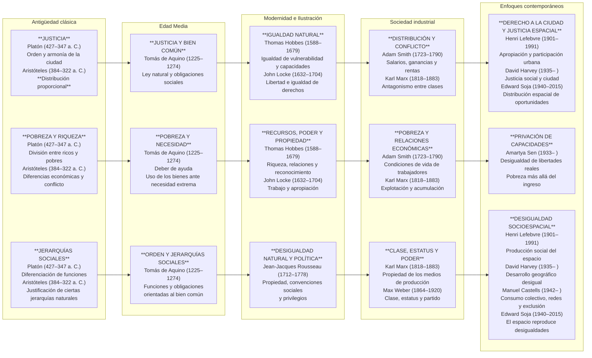

```mermaid
flowchart LR
    subgraph Clasica["Antigüedad clásica"]
        direction TB
        J1["**JUSTICIA**<br/>Platón (427–347 a. C.)<br/>Orden y armonía de la ciudad<br/>Aristóteles (384–322 a. C.)<br/>**Distribución proporcional**"]
        P1["**POBREZA Y RIQUEZA**<br/>Platón (427–347 a. C.)<br/>División entre ricos y pobres<br/>Aristóteles (384–322 a. C.)<br/>Diferencias económicas y conflicto"]
        D1["**JERARQUÍAS SOCIALES**<br/>Platón (427–347 a. C.)<br/>Diferenciación de funciones<br/>Aristóteles (384–322 a. C.)<br/>Justificación de ciertas jerarquías naturales"]
    end

    subgraph Medieval["Edad Media"]
        direction TB
        J2["**JUSTICIA Y BIEN COMÚN**<br/>Tomás de Aquino (1225–1274)<br/>Ley natural y obligaciones sociales"]
        P2["**POBREZA Y NECESIDAD**<br/>Tomás de Aquino (1225–1274)<br/>Deber de ayuda<br/>Uso de los bienes ante necesidad extrema"]
        D2["**ORDEN Y JERARQUÍAS SOCIALES**<br/>Tomás de Aquino (1225–1274)<br/>Funciones y obligaciones<br/>orientadas al bien común"]
    end

    subgraph Moderna["Modernidad e Ilustración"]
        direction TB
        J3["**IGUALDAD NATURAL**<br/>Thomas Hobbes (1588–1679)<br/>Igualdad de vulnerabilidad y capacidades<br/>John Locke (1632–1704)<br/>Libertad e igualdad de derechos"]
        P3["**RECURSOS, PODER Y PROPIEDAD**<br/>Thomas Hobbes (1588–1679)<br/>Riqueza, relaciones y reconocimiento<br/>John Locke (1632–1704)<br/>Trabajo y apropiación"]
        D3["**DESIGUALDAD NATURAL Y POLÍTICA**<br/>Jean-Jacques Rousseau (1712–1778)<br/>Propiedad, convenciones sociales<br/>y privilegios"]
    end

    subgraph Industrial["Sociedad industrial"]
        direction TB
        J4["**DISTRIBUCIÓN Y CONFLICTO**<br/>Adam Smith (1723–1790)<br/>Salarios, ganancias y rentas<br/>Karl Marx (1818–1883)<br/>Antagonismo entre clases"]
        P4["**POBREZA Y RELACIONES ECONÓMICAS**<br/>Adam Smith (1723–1790)<br/>Condiciones de vida de trabajadores<br/>Karl Marx (1818–1883)<br/>Explotación y acumulación"]
        D4["**CLASE, ESTATUS Y PODER**<br/>Karl Marx (1818–1883)<br/>Propiedad de los medios de producción<br/>Max Weber (1864–1920)<br/>Clase, estatus y partido"]
    end

    subgraph Actual["Enfoques contemporáneos"]
        direction TB
        J5["**DERECHO A LA CIUDAD Y JUSTICIA ESPACIAL**<br/>Henri Lefebvre (1901–1991)<br/>Apropiación y participación urbana<br/>David Harvey (1935– )<br/>Justicia social y ciudad<br/>Edward Soja (1940–2015)<br/>Distribución espacial de oportunidades"]
        P5["**PRIVACIÓN DE CAPACIDADES**<br/>Amartya Sen (1933– )<br/>Desigualdad de libertades reales<br/>Pobreza más allá del ingreso"]
        D5["**DESIGUALDAD SOCIOESPACIAL**<br/>Henri Lefebvre (1901–1991)<br/>Producción social del espacio<br/>David Harvey (1935– )<br/>Desarrollo geográfico desigual<br/>Manuel Castells (1942– )<br/>Consumo colectivo, redes y exclusión<br/>Edward Soja (1940–2015)<br/>El espacio reproduce desigualdades"]
    end

    J1 --> J2 --> J3 --> J4 --> J5
    P1 --> P2 --> P3 --> P4 --> P5
    D1 --> D2 --> D3 --> D4 --> D5
```
