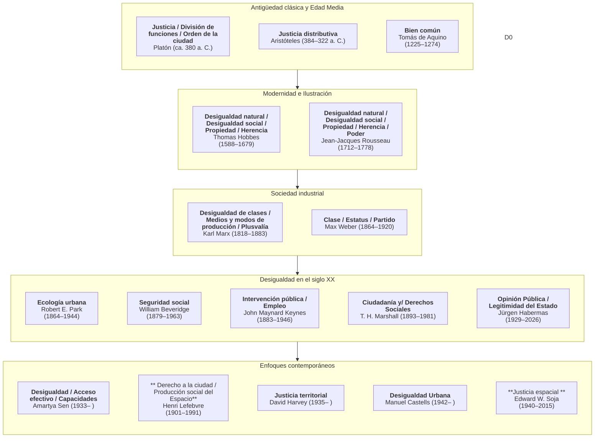

```mermaid
---
config:
  htmlLabels: false
---
flowchart TD
    subgraph A["Antigüedad clásica y Edad Media"]
        direction LR
        A1["`**Justicia / División de funciones / Orden de la ciudad**
Platón (ca. 380 a. C.)`"]
        A2["`**Justicia distributiva**
Aristóteles (384–322 a. C.)`"]
        A3["`**Bien común**
Tomás de Aquino (1225–1274)`"]

        A1 ~~~ A2 ~~~ A3
    end

    subgraph B["Modernidad e Ilustración"]
        direction LR
        B1["`**Desigualdad natural / Desigualdad social / Propiedad / Herencia**
Thomas Hobbes (1588–1679)`"]
        B3["`**Desigualdad natural / Desigualdad social / Propiedad / Herencia / Poder**
Jean-Jacques Rousseau (1712–1778)`"]

        B1 ~~~ B3
    end

    subgraph C["Sociedad industrial"]
        direction LR
        C1["`**Desigualdad de clases / Medios y modos de producción / Plusvalía**
Karl Marx (1818–1883)`"]
        C2["`**Clase / Estatus / Partido**
Max Weber (1864–1920)`"]

        C1 ~~~ C2
    end

    subgraph D["Desigualdad en el siglo XX"]
        direction LR
        D2["`**Ecología urbana**
Robert E. Park (1864–1944)`"]
        D3["`**Seguridad social**
William Beveridge (1879–1963)`"]
        D4["`**Intervención pública / Empleo**
John Maynard Keynes (1883–1946)`"]
        D5["`**Ciudadanía y/ Derechos Sociales**
T. H. Marshall (1893–1981)`"]
        D6["`**Opinión Pública / Legitimidad del Estado**
Jürgen Habermas (1929–2026)`"]

        D2 ~~~ D3 ~~~ D4 ~~~ D5 ~~~ D6
    end

    subgraph E["Enfoques contemporáneos"]
        direction LR
        E1["`**Desigualdad / Acceso efectivo / Capacidades**
Amartya Sen (1933– )`"]
        E2["`** Derecho a la ciudad /  Producción social del Espacio**
Henri Lefebvre (1901–1991)`"]
        E3["`**Justicia territorial**
David Harvey (1935– )`"]
        E4["`**Desigualdad Urbana**
Manuel Castells (1942– )`"]
        E5["`**Justicia espacial **
Edward W. Soja (1940–2015)`"]

        E1 ~~~ E2 ~~~ E3 ~~~ E4 ~~~ E5

    end
    A --> B --> C --> D --> E
    style D0 fill:none,stroke:none
```
