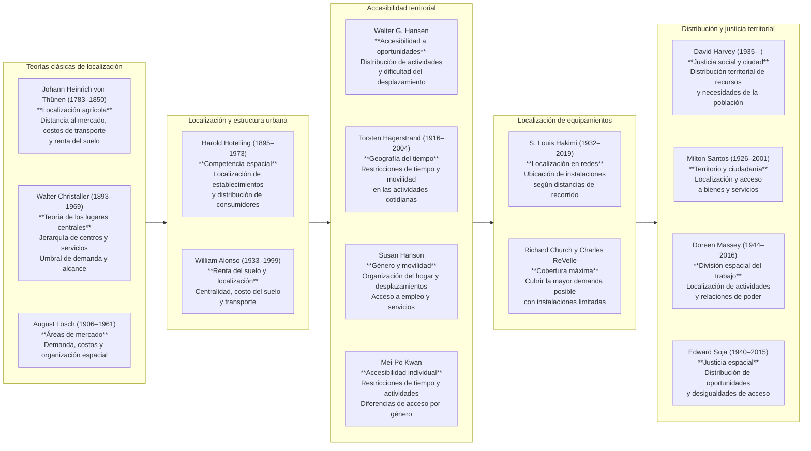

```mermaid
flowchart LR
    subgraph Clasicas["Teorías clásicas de localización"]
        direction TB
        Thunen["Johann Heinrich von Thünen (1783–1850)<br/>**Localización agrícola**<br/>Distancia al mercado, costos de transporte<br/>y renta del suelo"]
        Christaller["Walter Christaller (1893–1969)<br/>**Teoría de los lugares centrales**<br/>Jerarquía de centros y servicios<br/>Umbral de demanda y alcance"]
        Losch["August Lösch (1906–1961)<br/>**Áreas de mercado**<br/>Demanda, costos y organización espacial"]
        Thunen ~~~ Christaller
        Christaller ~~~ Losch
    end

    subgraph Espacial["Localización y estructura urbana"]
        direction TB
        Hotelling["Harold Hotelling (1895–1973)<br/>**Competencia espacial**<br/>Localización de establecimientos<br/>y distribución de consumidores"]
        Alonso["William Alonso (1933–1999)<br/>**Renta del suelo y localización**<br/>Centralidad, costo del suelo<br/>y transporte"]
        Hotelling ~~~ Alonso
    end

    subgraph Acceso["Accesibilidad territorial"]
        direction TB
        Hansen["Walter G. Hansen<br/>**Accesibilidad a oportunidades**<br/>Distribución de actividades<br/>y dificultad del desplazamiento"]
        Hagerstrand["Torsten Hägerstrand (1916–2004)<br/>**Geografía del tiempo**<br/>Restricciones de tiempo y movilidad<br/>en las actividades cotidianas"]
        Hanson["Susan Hanson<br/>**Género y movilidad**<br/>Organización del hogar y desplazamientos<br/>Acceso a empleo y servicios"]
        Kwan["Mei-Po Kwan<br/>**Accesibilidad individual**<br/>Restricciones de tiempo y actividades<br/>Diferencias de acceso por género"]
        Hansen ~~~ Hagerstrand
        Hagerstrand ~~~ Hanson
        Hanson ~~~ Kwan
    end

    subgraph Modelos["Localización de equipamientos"]
        direction TB
        Hakimi["S. Louis Hakimi (1932–2019)<br/>**Localización en redes**<br/>Ubicación de instalaciones<br/>según distancias de recorrido"]
        ChurchReVelle["Richard Church y Charles ReVelle<br/>**Cobertura máxima**<br/>Cubrir la mayor demanda posible<br/>con instalaciones limitadas"]
        Hakimi ~~~ ChurchReVelle
    end

    subgraph Critica["Distribución y justicia territorial"]
        direction TB
        Harvey["David Harvey (1935– )<br/>**Justicia social y ciudad**<br/>Distribución territorial de recursos<br/>y necesidades de la población"]
        Santos["Milton Santos (1926–2001)<br/>**Territorio y ciudadanía**<br/>Localización y acceso<br/>a bienes y servicios"]
        Massey["Doreen Massey (1944–2016)<br/>**División espacial del trabajo**<br/>Localización de actividades<br/>y relaciones de poder"]
        Soja["Edward Soja (1940–2015)<br/>**Justicia espacial**<br/>Distribución de oportunidades<br/>y desigualdades de acceso"]
        Harvey ~~~ Santos
        Santos ~~~ Massey
        Massey ~~~ Soja
    end

    Clasicas --> Espacial
    Espacial --> Acceso
    Acceso --> Modelos
    Modelos --> Critica
```
