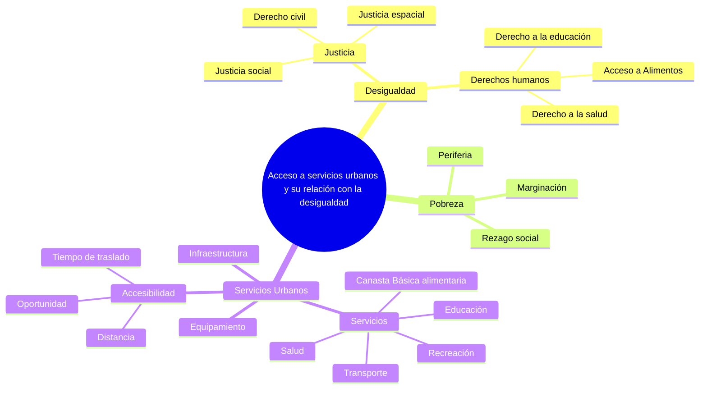

```mermaid
mindmap
  root((Acceso a servicios urbanos y su relación con la desigualdad))
    Desigualdad
      Justicia
        Derecho civil
        Justicia social
        Justicia espacial
      Derechos humanos
        Derecho a la salud
        Derecho a la educación
        Acceso a Alimentos
    Pobreza
      Rezago social
      Periferia
      Marginación
    Servicios Urbanos
      Equipamiento
      Infraestructura
      Servicios
        Salud
        Educación
        Canasta Básica alimentaria
        Transporte
        Recreación
      Accesibilidad
        Distancia
        Tiempo de traslado
        Oportunidad
```
